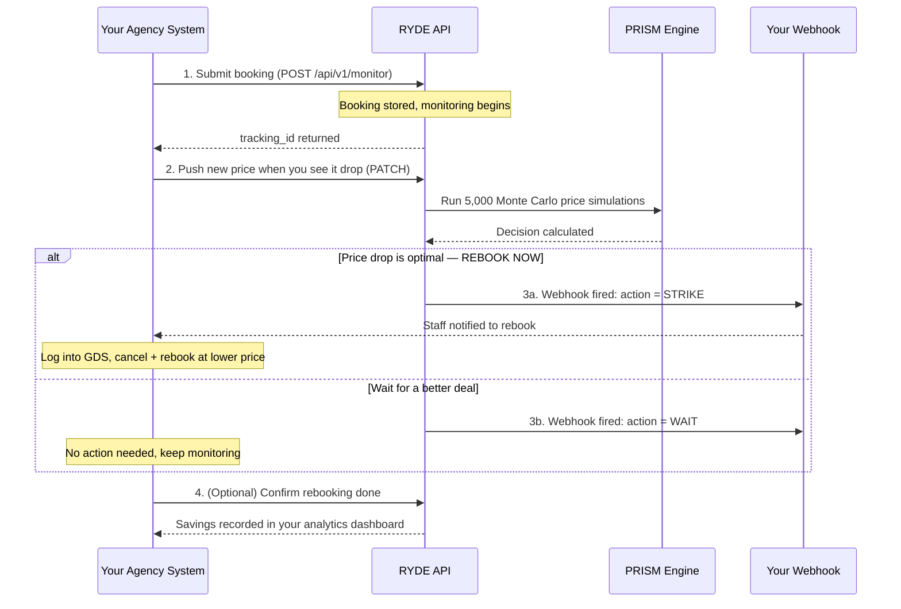

# RYDE API — Integration Guide

This guide walks you through connecting your agency's system to RYDE step by step.  
No deep technical knowledge required — just follow each step in order.

---

## How It Works (Plain English)

You submit a flight booking to RYDE. RYDE watches for the right moment to rebook it at a lower price. When the moment arrives, RYDE sends a signal (a "webhook") to your system. Your team then logs into your GDS and executes the rebooking.

RYDE never touches your GDS. It never cancels or books anything. It only tells you **when** to act.

---

## The Flow



---

## Before You Start

You will need:

| Item | Where to get it |
|---|---|
| **API Key** | Sign up at `/signup` (free) or `/pricing` (paid plans) |
| **Webhook URL** | A URL on your server that can receive HTTP POST requests |
| **curl** (for testing) | Already installed on Mac/Linux. Windows: use [curl.se](https://curl.se/windows/) or PowerShell |

> **Don't have a webhook server yet?**  
> Use [webhook.site](https://webhook.site) for free during testing — it gives you a URL instantly and shows every message received.

---

## Step 1 — Get Your API Key

Visit your RYDE dashboard and sign up. You will see your API key **once** — save it immediately in a safe place (a password manager is ideal).

Your key looks like this:
```
ryde_test_acmetravel_a3f9b2c1d4e5f6a7b8c9d0e1
```

Every request to the API must include this key in the header:
```
X-Agency-Key: ryde_test_acmetravel_a3f9b2c1d4e5f6a7b8c9d0e1
```

---

## Step 2 — Verify Your Connection

Before submitting any bookings, confirm the API is reachable:

```bash
curl https://YOUR-APP.railway.app/health
```

Expected response:
```json
{
  "status": "ok",
  "checks": {
    "db": "ok",
    "market": "ok",
    "prism_scan": "ok"
  }
}
```

If `status` is `"ok"` you are good to go.

---

## Step 3 — Verify Your API Key

```bash
curl https://YOUR-APP.railway.app/api/v1/account \
  -H "X-Agency-Key: YOUR_API_KEY"
```

Expected response:
```json
{
  "agency": "Acme Travel",
  "email": "ops@acmetravel.com",
  "environment": "test",
  "member_since": "2026-05-11T10:00:00Z"
}
```

---

## Step 4 — Submit a Booking for Monitoring

When a client has a refundable ticket and the price is now lower than what they paid, submit it to RYDE.

```bash
curl -X POST https://YOUR-APP.railway.app/api/v1/monitor \
  -H "X-Agency-Key: YOUR_API_KEY" \
  -H "Content-Type: application/json" \
  -H "Idempotency-Key: unique-request-id-001" \
  -d '{
    "origin": "JFK",
    "destination": "CDG",
    "departure_date": "2026-09-15",
    "original_price": 850.00,
    "cancellation_fee": 50.00,
    "current_price": 720.00,
    "seats_remaining": 4,
    "fare_type": "refundable",
    "cabin_class": "economy",
    "webhook_url": "https://your-server.com/webhook/ryde",
    "reference": "PNR-ABC123"
  }'
```

**Field explanations:**

| Field | What it means | Example |
|---|---|---|
| `origin` | 3-letter airport code where the flight departs | `"JFK"` |
| `destination` | 3-letter airport code where the flight lands | `"CDG"` |
| `departure_date` | Date of the flight (YYYY-MM-DD) | `"2026-09-15"` |
| `original_price` | What the client originally paid (USD) | `850.00` |
| `cancellation_fee` | Airline's fee to cancel and rebook | `50.00` |
| `current_price` | The price you see in your GDS **right now** | `720.00` |
| `seats_remaining` | How many seats are left at that price (1–9 increases urgency) | `4` |
| `fare_type` | Must be `refundable` or `partially_refundable` | `"refundable"` |
| `webhook_url` | Where RYDE sends its decision | `"https://..."` |
| `reference` | Your internal PNR or booking reference | `"PNR-ABC123"` |

> **Idempotency-Key tip:** Use a unique ID for each submission (e.g. a UUID or your PNR). If your network drops and you retry, RYDE returns the original response instead of creating a duplicate.

**Expected response:**
```json
{
  "tracking_id": "b2b_3f9a1c2d4e5f6a7b",
  "status": "monitoring",
  "route": "JFK-CDG",
  "original_price": 850.00,
  "current_price": 720.00,
  "prism_triggered": true,
  "submitted_at": "2026-05-11T14:30:00Z"
}
```

Save the `tracking_id` — you will need it to push price updates.

---

## Step 5 — Push a Price Update

When you check your GDS and the price has changed, tell RYDE. This triggers an immediate re-evaluation.

```bash
curl -X PATCH https://YOUR-APP.railway.app/api/v1/bookings/b2b_3f9a1c2d4e5f6a7b \
  -H "X-Agency-Key: YOUR_API_KEY" \
  -H "Content-Type: application/json" \
  -d '{
    "current_price": 640.00,
    "seats_remaining": 2
  }'
```

**Expected response:**
```json
{
  "ok": true,
  "tracking_id": "b2b_3f9a1c2d4e5f6a7b",
  "prism_triggered": true,
  "prism_skipped_reason": null
}
```

If `prism_triggered` is `true`, RYDE ran the analysis. If a STRIKE decision was reached, your webhook fires within seconds.

> If `prism_skipped_reason` is `"duplicate_price_cooldown"` it means you sent the same price within 5 minutes — RYDE skipped to avoid sending a duplicate signal.

---

## Step 6 — Receive the RYDE Decision Webhook

RYDE will POST to your `webhook_url` whenever a decision is made.

### STRIKE — Rebook now

```json
{
  "event": "ryde.decision",
  "booking_id": "b2b_3f9a1c2d4e5f6a7b",
  "action": "STRIKE",
  "confidence_score": 96.4,
  "net_savings": 160.00,
  "probability_of_future_drop": 3.2,
  "seat_urgency_multiplier": 1.84,
  "reasoning": "LSMC E[value]=$154 | ratio=1.04 | P(drop)=3% | days=127"
}
```

**Action required:** Log into your GDS, cancel the original booking, and rebook at the current lower price.

### PHANTOM_HOLD — Lock the fare, keep watching

```json
{
  "event": "ryde.decision",
  "action": "PHANTOM_HOLD",
  "confidence_score": 74.1,
  "net_savings": 130.00,
  "reasoning": "LSMC E[value]=$180 | ratio=0.72 | P(drop)=18% | days=45"
}
```

**Action required:** If your GDS supports fare holds, lock this fare now. RYDE will continue watching and send a STRIKE when the time is right.

### WAIT — Do nothing

RYDE does **not** send a webhook for WAIT decisions. Silence means wait.

---

## Step 7 — Verify the Webhook Is Really From RYDE

Every webhook includes an `X-RYDE-Signature` header. You should verify it to make sure the request came from RYDE and not someone else.

**Python example:**
```python
import hashlib
import hmac

def verify_ryde_webhook(body: bytes, signature_header: str, secret: str) -> bool:
    expected = "sha256=" + hmac.new(
        secret.encode(), body, hashlib.sha256
    ).hexdigest()
    return hmac.compare_digest(expected, signature_header)

# In your webhook handler:
body      = request.get_data()  # raw bytes
signature = request.headers.get("X-RYDE-Signature", "")
if not verify_ryde_webhook(body, signature, "YOUR_RYDE_WEBHOOK_SECRET"):
    return "Unauthorized", 401
```

**Node.js example:**
```js
const crypto = require('crypto');

function verifyRydeWebhook(body, signatureHeader, secret) {
  const expected = 'sha256=' + crypto
    .createHmac('sha256', secret)
    .update(body)
    .digest('hex');
  return crypto.timingSafeEqual(
    Buffer.from(expected),
    Buffer.from(signatureHeader)
  );
}
```

Your `RYDE_WEBHOOK_SECRET` is set in your Railway environment variables.

---

## Step 8 — Check Your Savings Dashboard

```bash
curl https://YOUR-APP.railway.app/api/v1/analytics \
  -H "X-Agency-Key: YOUR_API_KEY"
```

```json
{
  "agency": "Acme Travel",
  "total_monitored": 24,
  "currently_monitoring": 18,
  "total_savings_usd": 3840.00,
  "total_api_calls": 312
}
```

---

## Step 9 — Stop Monitoring a Booking

Once a booking has been rebooked (or the flight has departed), stop monitoring it:

```bash
curl -X DELETE https://YOUR-APP.railway.app/api/v1/bookings/b2b_3f9a1c2d4e5f6a7b \
  -H "X-Agency-Key: YOUR_API_KEY"
```

```json
{ "ok": true, "status": "stopped" }
```

---

## Step 10 — View the Full Audit Trail

Every decision PRISM made is stored permanently. Useful for explaining a rebooking to a client:

```bash
curl https://YOUR-APP.railway.app/api/v1/bookings/b2b_3f9a1c2d4e5f6a7b/audit \
  -H "X-Agency-Key: YOUR_API_KEY"
```

```json
{
  "tracking_id": "b2b_3f9a1c2d4e5f6a7b",
  "trail": [
    { "seq": 1, "event": "submitted",  "timestamp": "2026-05-11T14:30:00Z" },
    { "seq": 2, "event": "decision",   "detail": { "action": "WAIT",   "net_savings": 130.00 } },
    { "seq": 3, "event": "updated",    "detail": { "current_price": 640.00 } },
    { "seq": 4, "event": "decision",   "detail": { "action": "STRIKE", "net_savings": 160.00 } }
  ]
}
```

---

## Quick Reference — All Endpoints

| Method | Endpoint | What it does |
|---|---|---|
| `GET` | `/health` | Check API is up |
| `GET` | `/api/v1/account` | Your agency profile |
| `POST` | `/api/v1/monitor` | Submit a booking |
| `GET` | `/api/v1/bookings` | List all your bookings |
| `GET` | `/api/v1/bookings/{id}` | Get one booking's status |
| `PATCH` | `/api/v1/bookings/{id}` | Push a new price or update details |
| `DELETE` | `/api/v1/bookings/{id}` | Stop monitoring |
| `GET` | `/api/v1/bookings/{id}/audit` | Full decision history |
| `GET` | `/api/v1/analytics` | Savings dashboard |

---

## Common Errors

| HTTP Code | Meaning | Fix |
|---|---|---|
| `401` | Missing API key | Add `X-Agency-Key` header |
| `403` | Wrong or revoked key | Check your key at the dashboard |
| `422` | Invalid data | Check the error message — e.g. non-refundable fare, fee ≥ price |
| `429` | Too many requests | Wait 60 seconds and retry |
| `404` | Booking not found | Check the tracking_id belongs to your agency |

---

## Fare Rules

RYDE only accepts fares where rebooking can produce a real saving:

- `fare_type` must be `refundable` or `partially_refundable`
- `cancellation_fee` must be **less than** `original_price`
- `current_price` must be in the future (departure date > today)

Non-refundable fares are rejected at submission — there is nothing to rebook.

---

## Need Help?

| Question | Contact |
|---|---|
| API integration | api@ryde.io |
| Billing / account | api@ryde.io |
| Full API reference | `/api` on your RYDE dashboard |

---

*RYDE signals the moment. You execute the saving.*
